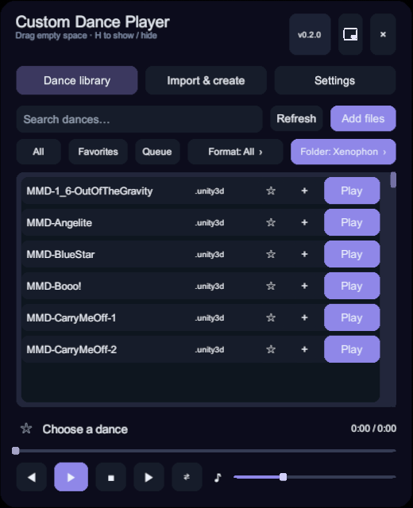
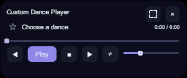
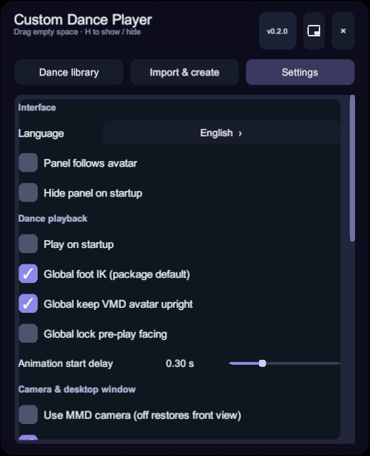

# [Mate Engine](https://github.com/shinyflvre/Mate-Engine) - Custom Dance Player

**Languages: [English](README.md), [中文](README_zh.md)**

This mod started as a way to play MMD dances converted for our 7 Days to Die VRoidMod in MateEngine. Dance playback later became part of MateEngine itself; this player continues to support the existing dance collection.

Version 0.2.0 adds VMD dance packages, an import and creation page, and full and mini player views. Existing `.unity3d` dances remain supported. See [what changed since 0.1](CHANGELOG.md).

Model: [Hatsune Miku (YYB Default)](https://steamcommunity.com/sharedfiles/filedetails/?id=3582662597) by YYB, from the MateEngine Workshop. Dance: Catch The Wave. The library panel follows the character while the front camera stays active.

## Installation and migration

Download the `With-BepInEx` archive, exit the game, and extract everything beside `MateEngineX.exe`. When upgrading from 0.1.x, run `Run-OldVersionMigration.cmd`. Start the game and press **H** to open the player.

For later updates to an existing compatible BepInEx installation, use the smaller plugin archive. See [installation instructions](docs/user/INSTALL_0.2.md). Supported hosts are Windows x64 MateEngine GitHub 3.3 and Steam 3.4.

## Using the player

### Dance library

Place dances in `MateEngineX_Data/StreamingAssets/CustomDances`; subfolders can organize your collection. You can also use **Add files** or open the dance folder from Settings. Refresh the library after adding files.

| Format | Description |
| --- | --- |
| `.unity3d` | Existing animation and audio bundles, including expressions and MMD cameras |
| `.me` | Official dance containers; ordinary avatar or object mods are not dances |
| `.vmdance` | A package containing VMD motion, expressions, lip sync, camera and audio |
| `.vmd` | Direct motion preview; use the creation page to package accompanying files |

Search and filter by format or folder, browse favorites, or create a queue. The star saves a favorite and `+` adds a dance to the queue. The current dance also has a favorite button beside its title.

The bottom bar provides seeking, previous, play/pause, stop, next and volume. Its playback order button cycles through sequential playback, repeat one and shuffle. This bar appears in the library and creation pages; Settings uses the space for options.

The small window icon switches to the mini player; the expand icon returns to the full view. Each view remembers its position. Drag an empty area to move the panel. You can also drag the character while the panel is open.

### Import and create

Choose a body motion VMD and optional audio, enter a title, then add the dance to the library and preview it. Folder matching can fill in a set of accompanying files. Expressions, lip sync and cameras embedded in the body VMD are included; separate files can be added in Advanced options. Hover over or click `?` for help.

**Open dance package** restores an existing `.vmdance` and its settings for preview, editing or exporting a copy. Use the music timing controls to adjust synchronization while listening.

For dances with a camera, the creator captures the current character's reference eye height. Adjust the reference multiplier during preview to frame that character. Other characters are then adapted using their own eye height. Foot IK preferences can also be saved per dance.

See the [creation guide](docs/user/IMPORT_AND_CREATE.md) for steps and field descriptions.

### Settings

Configure panel and desktop-window following, startup playback, background shadows, MMD cameras and global VMD options. Enabling an MMD camera switches to the dance camera; disabling it or stopping playback restores the front camera. Native game menus temporarily use the front camera and resume the dance camera when closed.

Shortcuts are customizable. Click a key button and press a new combination; Esc cancels. The switch on the left temporarily disables the shortcut while keeping its binding; the buttons on the right clear or reset it. **H** opens the panel by default. Play/pause, play/stop, stop, previous and next can each be bound separately. Matching global shortcuts can control multiple MateEngine instances together.

### Languages

English and Simplified Chinese are included. Additional languages can be added by translating a JSON file; see [adding a language](docs/dev/LOCALIZATION.md).

## Old dance audio stalls: DanceBundleAudioFixer

Some old `.unity3d` bundles stall while loading audio. The optional `DanceBundleAudioFixer.rar` is available in the [0.1.2 release assets](https://github.com/maoxig/MateEngine-CustomDancePlayer/releases/tag/v0.1.2).

Exit the game, select your `CustomDances` folder in the tool, scan, and repair with backups. Its default folder targets 7 Days to Die, so MateEngine users need to choose their folder manually. See the [tool guide](docs/user/DANCE_BUNDLE_AUDIO_FIXER.md).

## Dance resources and feedback

Previously converted dances are available on [Google Drive](https://drive.google.com/drive/folders/1YU7-Hz-O8-9B2E58mxQxexJTBTCT42jr?usp=sharing). **The converter does not permit uploading these dances to Steam Workshop. Please respect this restriction and each work's usage rules.**

The [demo video](https://www.bilibili.com/video/BV1Yge6zqETU/) and [0.1.2 instructions](docs/legacy/LEGACY_0.1.2_README.md) remain available. When reporting an issue, include the game version, dance file, model, reproduction steps and relevant errors from `BepInEx/LogOutput.log`.
