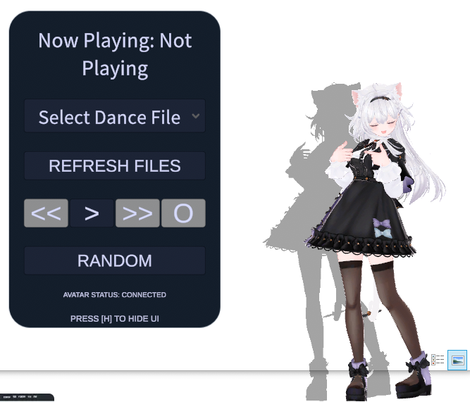
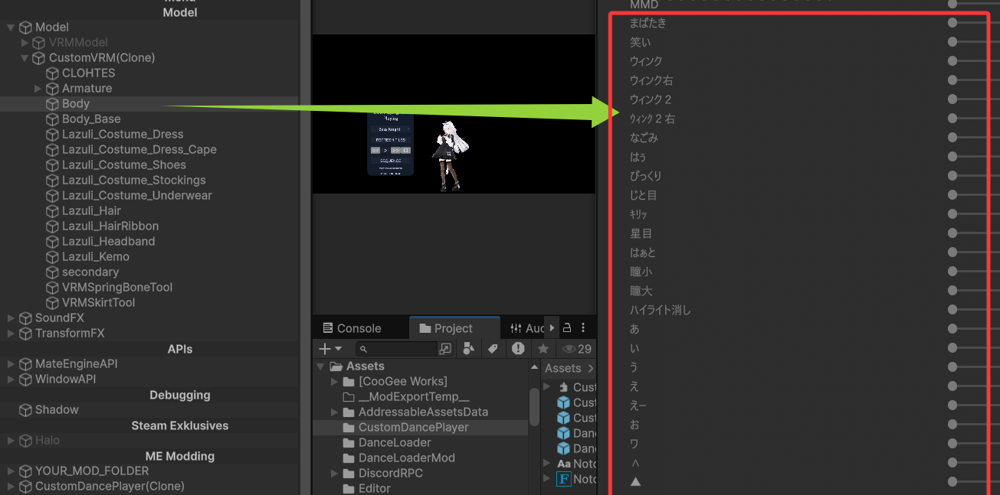
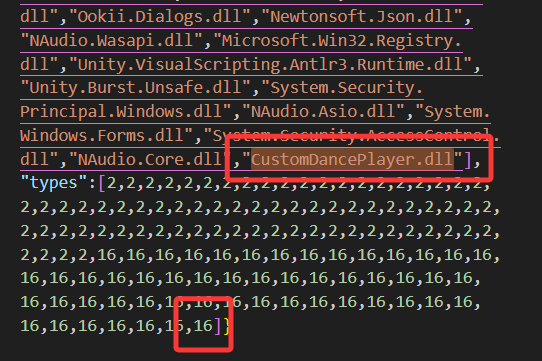
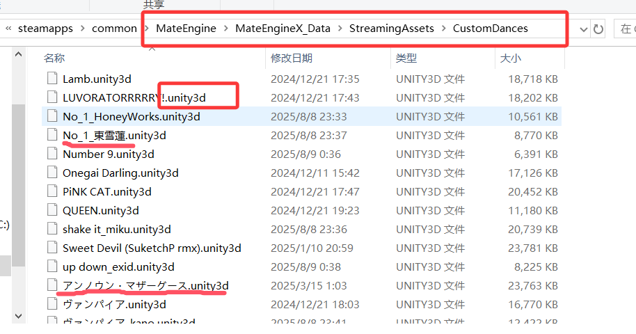

# Mate Engine - Custom Dance Player

**Other Language Versions: [English](README.md), [中文](README_zh.md)**

Note: I am a non-English speaker and a beginner in C#/Unity. As a result, I may have used AI extensively. Please bear with me if there are any inconsistencies.

## Preview

    
    

## Introduction
I only recently came into contact with MATE-ENGINE. Previously, I was a player for *7 Days to Die*—. There is a mod [VRoidMod](https://www.nexusmods.com/7daystodie/mods/3501) by author Alter that was well-received by the Chinese community. It allows players to switch character models and perform dances in the game.

Along with friends from the community, we converted over 150+ dance files for use with VRoidMod (mainly from MMDs, and the number is still growing). We also experimented with embedding facial expression curves and camera curves into animations, letting us dance to MMD-style animations whenever we felt bored in *7 Days to Die*! You can see the effect in this video (apologies for non-Chinese users):

https://www.bilibili.com/video/BV12Cb6zjEfS/

After discovering the MATE-ENGINE project, I found it very interesting and wondered if I could adapt the dance files we created for *7 Days to Die* to work with MATE-ENGINE. I also noticed multiple requests for custom dance functionality in MATE-ENGINE’s GitHub Issues, so I decided to develop this mod. Again, please excuse any rough edges as I am new to C# and Unity.

## Project Overview
This is a custom mod developed for the **Mate Engine** desktop pet game. Its core functionality is to add "dance player" capabilities to the desktop pet—supporting custom dance resource loading, playback mode switching, playback control, and an intuitive UI interface. Users can manage the pet’s dance playback just like operating a music player.

### Download Mod Files (Excluding Dance Files)

You can download the latest release of the mod (does **not** include dance files) here:  
[https://github.com/maoxig/MateEngine-CustomDancePlayer/releases](https://github.com/maoxig/MateEngine-CustomDancePlayer/releases)

The mod consists of three main parts:
1. **.me Mod Package**: Contains UI prefabs (e.g., playback control buttons, track dropdown, status text) and basic UI style resources, exported using the MATE-ENGINE SDK.
2. **DLL Scripts**: Handle core logic, including dance resource loading/unloading, playback state management, and UI event binding. This part involves custom C# scripts and may require modifying game DLL references in dangerous ways (which may not be permitted). By using this DLL, you acknowledge that you trust this repository—you can review the source code to understand its implementation, or fork the repo to modify and compile your own version.
3. **Dance Files**: Custom dance resources that must follow specific formatting (see [Usage Guide](#usage-guide)). You can also download pre-converted dance files (a subset of the 100+ files my friends in *7 Days to Die* community created, mostly converted from MMD motion data):
   - https://www.nexusmods.com/7daystodie/mods/3956
   - https://www.nexusmods.com/7daystodie/mods/5430
   - https://www.7risha.com/rolemodel (may be less user-friendly for non-Chinese users, apologies)
   
   **Important for Non-East Asian Users**: These .unity3d files may contain Simplified Chinese, Traditional Chinese, Japanese, or Korean (CJK) characters in their filenames. Ensure the files unzip and display correctly (adjust your unzipping software’s name encoding settings, install required fonts, etc.), otherwise the mod may fail to load the dances.

If there is sufficient interest, I may collect all dance files and upload them to a cloud storage service. (Note: These files are converted from MMD .vmd motion data—please comply with relevant laws and copyright regulations when using them.)

## Core Features

### Dance Player
No extra explanation needed—it’s straightforward: load dance files from disk in a specific order and play them like a music player.

### Facial Expression Support
Nearly all the .unity3d dance files 7DTD community created support facial expressions (since most are converted from MMD motion data, which typically includes expression data). However, this requires the character model to follow specific conventions:

The **Skinned Mesh Renderer** on the model’s "Body" object must include MMD-style Japanese-named blend shapes:  

If you convert a PMX model to FBX/VRM using Unity’s MMD4Mecanim + uniVRM plugins:
1. Before conversion, go to MMD4Mecanim’s advanced settings and **uncheck "PrefixMorphNoName"** (this option adds numeric prefixes to blend shape names, which breaks compatibility).
2. Adjust the model’s hierarchy to match the structure shown above.

For other model types, the most universal solution is to modify and adjust the model in Blender to meet the above conventions.

### Camera Support (?)
We implemented MMD-style camera movement in *7 Days to Die*, but MATE-ENGINE may not require camera functionality. 

## Installation Steps
### Prerequisites
- **Mate Engine** desktop pet game installed
- Downloaded dance files (with .unity3d extension)

### 1. Deploy Mod Files
The mod requires both the **.me Mod Package** and **DLL Scripts** to work.

#### Step 1.1: Add DLL Scripts to the Game
This step requires caution, as it may cause game crashes or unexpected behavior. **Backup the files you intend to modify first**. Game updates may also require you to reapply these changes—this is the simplest method I’ve found so far, but better alternatives may exist.

   a. Place the `CustomDancePlayer.dll` file into the game’s `MateEngine\MateEngineX_Data\Managed` folder.  
   

        
   

   b. Modify `MateEngineX_Data\ScriptingAssemblies.json` to reference the new DLL:
      - Add `"CustomDancePlayer.dll"` to the `"names"` array.
      - Add `16` to the `"types"` array.  
   

        
   

#### Step 1.2: Load the .me Mod Package
   

        
   

#### Step 1.3: Load Dance Files (.unity3d Format)
If all steps above are completed correctly, you will see the mod’s UI panel. Place your downloaded .unity3d dance files into the `MateEngineX_Data\StreamingAssets\CustomDances` folder, then click the "Refresh" button in the UI to load the dance resources.  
   

        
   

## Usage Guide
The mod works just like a standard music player—controls are intuitive and require no additional explanation.

## Custom Dance File Specifications
Dance resources must follow these rules to load correctly. I also provide a toolbox to help you quickly convert MMD motions, expressions, and camera data into compatible dance files (takes ~3 minutes per file):  
https://github.com/maoxig/VroidMMDTools  

(Apologies for the lack of English documentation—I will add English instructions for the tool when I have time.)

### Dance File Structure (.unity3d AssetBundle)
Each dance corresponds to one `.unity3d` AssetBundle, which must contain the following resources (**filenames must match exactly**):

| Resource Type       | Filename Specification          | Description                                                                                                                                                                                                                                                                                                           |
| ------------------- | ------------------------------- | --------------------------------------------------------------------------------------------------------------------------------------------------------------------------------------------------------------------------------------------------------------------------------------------------------------------- |
| Animator Controller | `[DanceName].controller`        | A simple single-state controller: Create a new Animator Controller, then drag the corresponding [DanceName].anim file into the controller window. Unity will automatically generate a single animation state, and the controller’s "Entry" (default entry point) will have an unconditional transition to this state. |
| Audio File          | `[DanceName].wav`/`.mp3`/`.ogg` | Supports 3 common audio formats. Duration must match the animation (to avoid audio-visual desync).                                                                                                                                                                                                                    |
| Animation           | `[DanceName].anim`              | Must include the dance’s animation data.                                                                                                                                                                                                                                                                              |

Example:  
For a dance file named "HappyDance.unity3d", the AssetBundle must contain `HappyDance.controller`, `HappyDance.mp3`, and `HappyDance.anim`.

### Dance File Placement
Place your `.unity3d` dance files into the `StreamingAssets/CustomDances` directory. The mod will automatically detect them and add them to the track list.
   

        
   

## Technical Details (For Developers)
The overall logic is simple—you can easily understand it by reviewing the source code. To modify the mod:
1. Drag the .prefab files into your MATE-ENGINE Unity project, along with the relevant scripts, to edit the UI.
2. To modify the DLL scripts: Edit the code in Visual Studio, compile it into a DLL, and import it into Unity.

## Frequently Asked Questions (FAQ)
### Q1: The UI doesn’t appear when pressing the H key—what should I do?
- Check if the DLL loaded successfully (the UI will show a warning if the DLL is missing).
- Ensure the mouse focus is on the MATE-ENGINE window.

### Q2: Dance files fail to load, and the character stays in a T-pose—how to fix this?
- Verify the file path: Ensure `.unity3d` files are placed in `StreamingAssets/CustomDances`.
- Check for garbled filenames: Avoid special characters or unrecognized symbols in filenames (these can break controller/audio loading).

### Q3: No audio plays during dance playback—why?
- Check the audio file: Ensure the .unity3d AssetBundle contains an audio file in `.wav`, `.mp3`, or `.ogg` format (only these 3 formats are supported).
- Verify the audio filename: The audio file’s name must exactly match the .unity3d file name (e.g., `HappyDance.unity3d` requires `HappyDance.mp3`).

### Q4: The UI shows square boxes (garbled text)—how to resolve this?
- Root cause: The UI font does not support CJK characters.
- I tried multiple solutions but couldn’t find a better fix, so I included the `NotoSansCJK-Regular.ttc` font in the .me mod package, though there may still be some font issues. If you have suggestions for improvement, feel free to share them via PR or Issue.

## License
This mod is open-source under the **MIT License** and complies with the official [Mate Engine License](https://github.com/shinyflvre/Mate-Engine/blob/main/LICENSE). It is permitted for **personal non-commercial use, modification, and distribution**, but prohibited for commercial profit. By using this mod, you agree to abide by the official Mate Engine terms. The developer is not liable for any game errors or issues caused by this mod.

- License Details: [MIT License](https://opensource.org/licenses/MIT), [MATE-ENGINE License](https://github.com/shinyflvre/Mate-Engine/blob/main/LICENSE)
- Prohibited Actions: Integrating this mod into commercial software without permission, or redistributing it after removing copyright information.
- Note for Japanese Users: The aforementioned .unity3d dance files may involve copyright issues in Japan (most are converted from MMD motion data, which may not be permitted). Do not upload these files, images, videos, or other related resources to public platforms.

## Contact & Feedback
If you encounter issues or have feature requests, please provide feedback via:
- GitHub Issues: [Submit an Issue](https://github.com/maoxig/MateEngine-CustomDancePlayer/issues)

**Last Updated**: August 23, 2025  
**Compatible Mate Engine Version**: 1.9.0b
