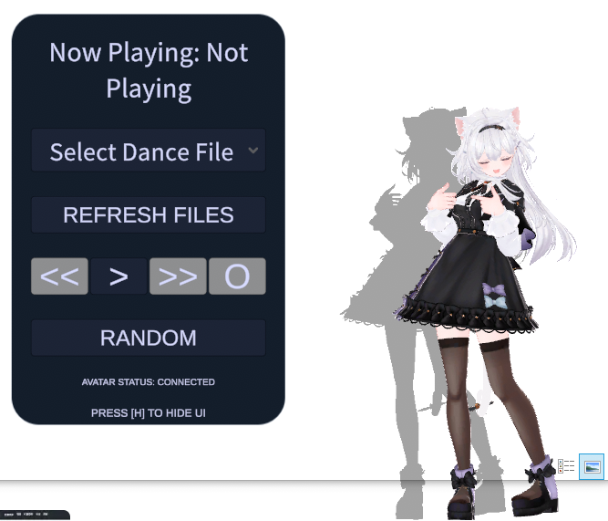
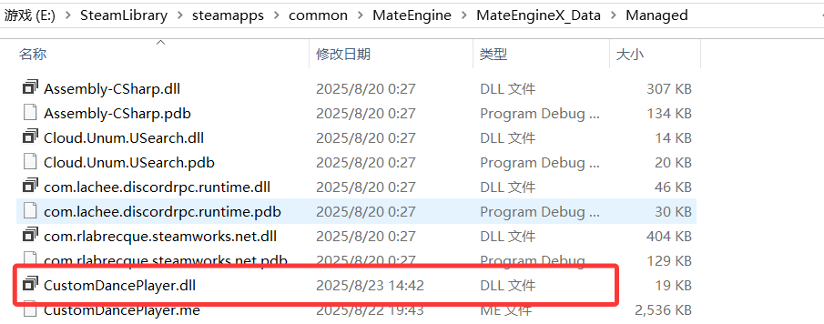
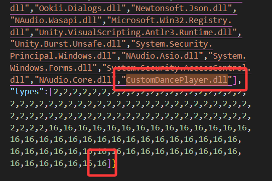
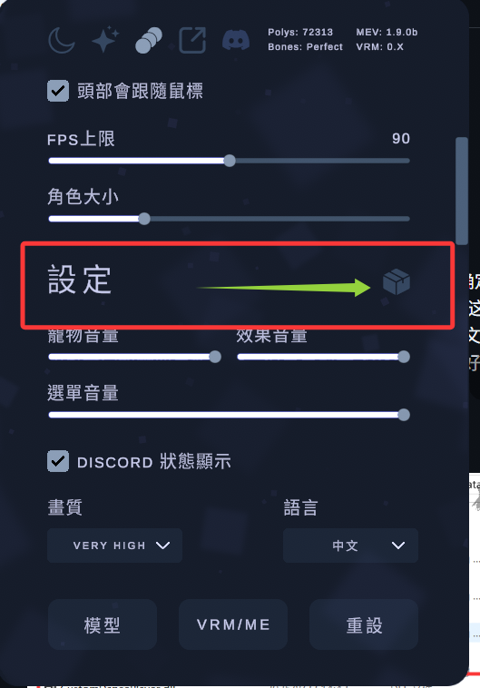
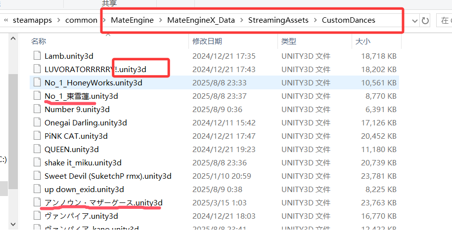
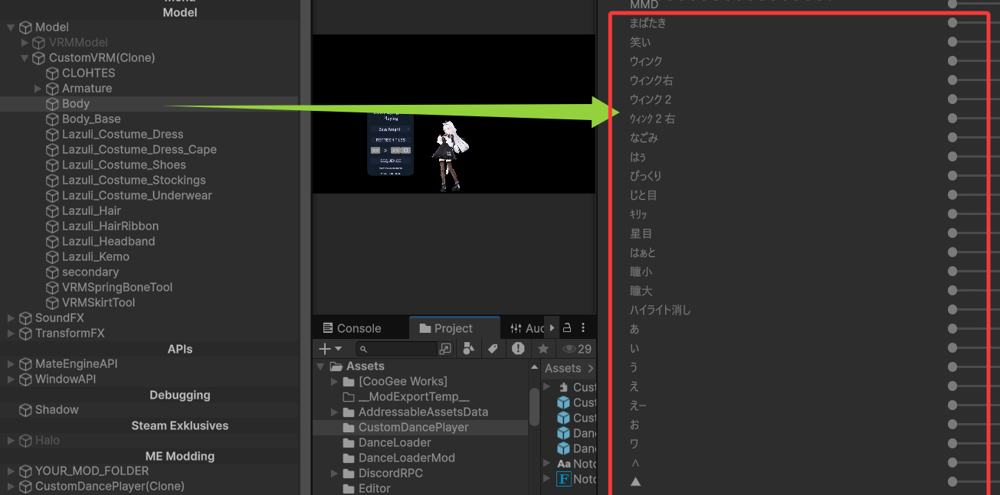

# [Mate Engine](https://github.com/shinyflvre/Mate-Engine) - 自定义舞蹈播放器

**其他语言版本: [English](README.md), [中文](README_zh.md)**

注意：我是非英语使用者，并且是C#/Unity新手，因此可能大量使用AI，请多包涵。

## 预览图

    
    

## 前言

实际上我是最近才接触到MATE-ENGINE，我之前是7日杀的玩家，其中的[VRoidMod](https://www.nexusmods.com/7daystodie/mods/3501)受到了我们中文社区的广泛喜欢（它支持在游戏中切换角色模型、跳舞）。因此我和我社区上的朋友转换了大量的可供VRoidMod使用的舞蹈文件（主要来自于MMD，总计150+并且仍在增长），并且通过尝试将表情曲线、镜头曲线写入到anim中，使得我们在七日杀游戏中无聊时可以随时跳上一段MMD！效果就是下面这个视频（非中文用户抱歉）：

https://www.bilibili.com/video/BV12Cb6zjEfS/

最近看到MATE-ENGINE这个项目后觉得非常有趣，我就在思考是否能够让MATE-ENGINE也能够使用我们之前在七日杀的舞蹈文件。并且我看到ME的ISSUE中有不少人希望能有自定义跳舞的功能，因此我尝试着为它开发了这个Mod，不过由于我是C#/Unity新手因此请多包涵。

## 项目介绍
这是一款为 **Mate Engine** 桌宠游戏开发的自制Mod，核心功能是让桌宠具备「舞蹈播放器」的能力——支持加载自定义舞蹈资源、切换播放模式、控制播放流程，同时提供直观的UI交互界面，让用户能像操作音乐播放器一样管理桌宠的舞蹈播放。

### 下载Mod文件（不含舞蹈文件）

你可以在这里下载本Mod的最新发布版本（**不包含舞蹈文件**）：  
[https://github.com/maoxig/MateEngine-CustomDancePlayer/releases](https://github.com/maoxig/MateEngine-CustomDancePlayer/releases)

Mod 分为这几部分
1. **.me模组**：包含UI预制体（如播放控制按钮、曲目下拉框、状态文本）、基础UI样式资源，这些由MATE-ENGINE SDK导出
2. **DLL 脚本**：核心逻辑，舞蹈资源加载/卸载、播放状态管理、UI事件绑定等。这部分由于涉及到自定义C#脚本，并且需要以危险的方式修改游戏DLL引用（这也许是不被允许的），因此使用该DLL意味着你已经信任该仓库（你可以查看源代码以了解其实现细节，或者你也可以自己fork然后修改编译）
3. **舞蹈文件**：自定义的舞蹈资源，需遵循特定格式（详见使用指南）。你也可以从以下链接下载已有的舞蹈（由我在七日杀社区的朋友制作转换的一部分，但是也有总共100+，主要转换自MMD的动作数据）
   
   - https://www.nexusmods.com/7daystodie/mods/3956
   - https://www.nexusmods.com/7daystodie/mods/5430
   - https://www.7risha.com/rolemodel (对非中文用户可能不友好，抱歉)
    

    **非东亚用户注意！这些.unity3d文件的文件名中可能混杂了简中繁中日韩等字符，因此你必须确保它们正常解压并显示（修改解压软件的名称编码、添加字体等），否则可能将无法正常加载舞蹈**

  如果喜欢的人多，我也许会收集全部然后把它们上传到云盘。（这些数据来自于MMD动作.vmd，使用时请遵循相关法律法规）

## 安装步骤
### 前置要求
- 已安装 **Mate Engine** 桌宠游戏
- 下载了 .me & .dll 文件（[这里](https://github.com/maoxig/MateEngine-CustomDancePlayer/releases)）
- 下载舞蹈文件（.unity3d后缀）

国内用户可以直接看我b站上传的视频教程

https://www.bilibili.com/video/BV1Yge6zqETU/

### 1. 部署 Mod 文件
Mod 由「.me模组」和「DLL脚本」两部分组成

- 添加DLL脚本到游戏中（也许有更好的方式，而且我不确定这样做是否合适，但是至少这对我来说有用）
  这一步必须非常谨慎，因为这很可能会导致游戏崩溃或其他不可预知的问题，因此建议你备份将要修改的文件。并且，游戏更新可能也会导致需要重新设置。但是目前我还没有找到更好、更简单的添加dll的方法。

    a. 将 `CustomDancePlayer.dll` 文件放入游戏目录的 `MateEngine\MateEngineX_Data\Managed` 文件夹中。
    

        
    

    b. 修改`MateEngineX_Data\ScriptingAssemblies.json`引用新增的dll。具体来说，在`'names"`数组中添加 `"CustomDancePlayer.dll"`，在`"types"`数组中添加 `16`。

    

        
    

    

- 加载.me模组

    

        
    

- 加载舞蹈文件（.unity3d格式）

    如果以上步骤无误，你将会看到一个正确的UI面板，之后将下载的舞蹈文件放入 `MateEngineX_Data、StreamingAssets/CustomDances` 目录下，点击刷新按钮即可加载舞蹈资源。

    

        
    

## 核心功能特性

### 舞蹈播放器

不再多介绍，因为非常容易理解。从磁盘按某种顺序加载舞蹈文件并像播放音乐一样播放它们。

### 表情支持

实际上，我们之前制作的舞蹈.unity3d全部都是支持舞蹈表情的（因为它们大部分转换自MMD的动作数据，而MMD的动作数据通常包含表情），然而这需要模型遵循一定的约定：

模型的Body物体上的Skinned Mesh Renderer有MMD的日语形态键：

通常如果你使用unity的MMD4Mecanim+uniVRM插件将pmx模型转换为fbx/vrm，你需要确保在MMD4Mecanim插件转换前的高级选项里取消勾选PrefixMorphNoName（因为这会给形态键添加上序号前缀），然后调整一下模型的层级结构符合上述规范即可。

如果是其他类型，最通用的方法是使用Blender修改、调整以符合上述约定。

### 镜头支持（？）

我们在七日杀这款游戏实现了MMD的运镜，但是也许MATE-ENGINE并不需要镜头？

## 使用指南

非常简单，这个MOD就类似一个音乐播放器。

## 自定义舞蹈文件
舞蹈资源需按以下规范制作，否则可能加载失败，此外我提供了一个我自己的工具箱，你可以在其中方便快速地（~3min）将一个MMD动作、表情、镜头转换为可使用的舞蹈文件。
https://github.com/maoxig/VroidMMDTools

（非中文用户抱歉，我有时间会提供英文版的工具使用说明）

#### 舞蹈文件结构（.unity3d AssetBundle）
每个舞蹈对应一个 `.unity3d` 格式的AssetBundle，内部必须包含以下资源（命名需一致）：
| 资源类型                          | 文件名规范                   | 说明                                                        |
| --------------------------------- | ---------------------------- | ----------------------------------------------------------- |
| 动画控制器（Animator Controller） | `[舞蹈名].controller`        | 这个controller包含一个state（即舞蹈动画）                   |
| 音频文件                          | `[舞蹈名].wav`/`.mp3`/`.ogg` | 支持3种常见音频格式，时长需与动画时长匹配（避免音画不同步） |
| 动画（Animation）                 | `[舞蹈名].anim`              | 需包含舞蹈的动画数据                                        |

示例：  
若舞蹈名为「HappyDance」，则AssetBundle内需包含 `HappyDance.controller` 和 `HappyDance.mp3`。

#### 放置舞蹈文件
将制作好的 `.unity3d` 舞蹈文件放入 `StreamingAssets/CustomDances` 目录，Mod会自动识别并添加到曲目列表。
   

        
   

## 技术细节（面向开发者）

整体逻辑非常简单，只需要查看源码你就很容易理解。如果要修改的话，把.prefab拖到MATE-ENGINE的unity project中，然后把相关的脚本和一起拖入，然后你就可以编辑。如果要修改DLL脚本，你需要单独通过VS修改，然后编译为DLL之后放到Unity中。

## 常见问题（FAQ）
### Q1：UI 按 H 键不显示怎么办？
- 检查DLL是否成功加载（如果未成功加载UI会有提示）
- 确保鼠标焦点在MATE-ENGINE软件上

### Q2：舞蹈文件加载失败，人物跳舞时变成T-Pose不能动？
- 检查文件路径：确保 `.unity3d` 放在 `StreamingAssets/CustomDances` 目录下。
- 检查文件文件名：确保 `.unity3d` 文件名中不包含乱码等（因为这会影响控制器、音频的读取）。

### Q3：UI 显示方块字（乱码）怎么解决？
- 我已经修改了UI组件，使用unity默认的text组件，通常他不会再有方块字乱码，如果出现了，请检查你的系统字体是否支持CJK字符。

### Q4：加载UI/舞蹈/DLL失败？
- 请检查以下内容：
  - 确保所有文件都已正确放置在指定目录中，并且文件名没有被修改过（游戏和mod依赖文件名）。
  - 尝试重新加载游戏或重启软件。

## 许可证
本Mod采用 **MIT 许可证** 开源，并且遵循Mate Engine 官方的[协议](https://github.com/shinyflvre/Mate-Engine/blob/main/LICENSE)，允许个人非商业使用、修改和分发，禁止用于商业盈利目的。使用前请遵守 Mate Engine 官方的[协议](https://github.com/shinyflvre/Mate-Engine/blob/main/LICENSE)，若因Mod使用导致游戏异常，开发者不承担责任。

- 许可证详情：[MIT License](https://opensource.org/licenses/MIT)， [MATE-ENGINE协议](https://github.com/shinyflvre/Mate-Engine/blob/main/LICENSE)
- 禁止行为：未经授权将本Mod整合到商业软件、或移除版权信息后分发。
- 此外，对于**日本用户**，上述提及的舞蹈.unity3d文件在日本也许涉及版权问题（它们大部分转换自MMD的动作数据，这也许是不被允许的），因此请不要上传文件、图像、视频等资源到公共平台。

## 联系与反馈
若遇到问题或有功能建议，可通过以下方式反馈：
- GitHub Issues：[提交Issue](https://github.com/maoxig/MateEngine-CustomDancePlayer/issues)

**最后更新时间**：2025年8月23日  
**适配Mate Engine版本**：1.9.0b
