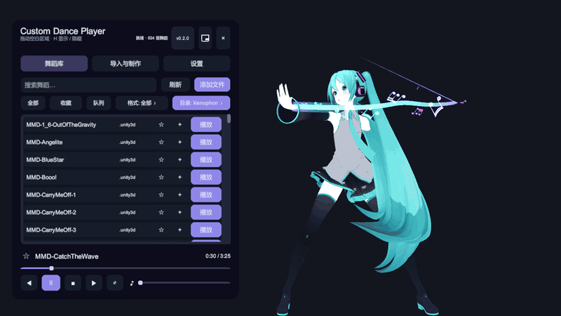
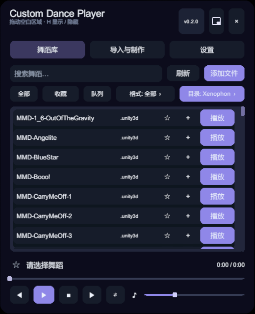
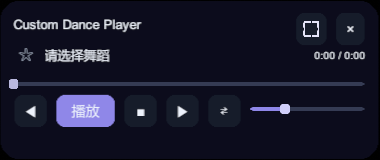
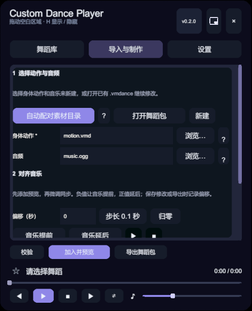
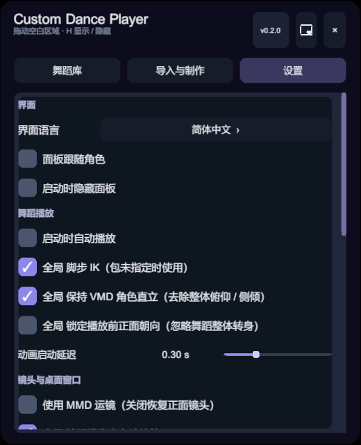

# [Mate Engine](https://github.com/shinyflvre/Mate-Engine) - 自定义舞蹈播放器

**其他语言版本：[English](README.md)，[中文](README_zh.md)**

这个 Mod 最早是为了在 MateEngine 中播放我们为七日杀 VRoidMod 转换的 MMD 舞蹈。后来舞蹈功能进入了官方版本，独立播放器也继续维护，希望已有的舞蹈资源能一直用下去。

v0.2.0 加入了 VMD 舞蹈包、导入与制作页面，以及完整／迷你两种播放器界面。以前的 `.unity3d` 舞蹈仍然可以使用。这个版本的变化见 [v0.2.0 更新说明](CHANGELOG_zh.md)。

演示模型：[Hatsune Miku (YYB Default)](https://steamcommunity.com/sharedfiles/filedetails/?id=3582662597)，模型作者 YYB，来自 MateEngine 创意工坊。演示动作：Catch The Wave；正面镜头，舞蹈库面板跟随角色。

## 安装与迁移

推荐下载文件名带 `With-BepInEx` 的整合包，退出游戏，把全部内容解压到 `MateEngineX.exe` 同级。安装过旧版 0.1.x 用户第一次安装时需要再双击 `Run-OldVersionMigration.cmd`（其他玩家不需执行），完成后正常启动游戏，按 **H** 打开播放器。

已经安装过这套 BepInEx 的用户，后续更新可以使用较小的插件包。详见 [安装说明](docs/user/INSTALL_0.2.md)，或者下载整合包并覆盖安装就行。适用版本为 Windows x64 的 MateEngine GitHub 3.3 和 Steam 3.4。

## 使用

### 舞蹈库页面

把舞蹈放在 `MateEngineX_Data/StreamingAssets/CustomDances`，支持按子文件夹分类。也可以点击“添加文件”，或者在设置底部打开舞蹈目录。加入文件后点击“刷新”。

| 格式 | 说明 |
| --- | --- |
| `.unity3d` | 以前的动画与音频包，支持表情和 MMD 镜头 |
| `.me` | 官方舞蹈包；普通角色或物件 Mod 不属于舞蹈 |
| `.vmdance` | 包含身体动作、表情、口型、镜头和音频的 VMD 舞蹈包 |
| `.vmd` | 直接试播动作；配套资源可在制作页打包 |

舞蹈库可以搜索，按格式、目录筛选，也可以查看收藏和队列。每首舞蹈旁的星标用于收藏，`+` 用于加入队列。正在播放时，底栏曲名旁也有收藏按钮。

底栏支持进度跳转、上一首、播放／暂停、停止、下一首和音量调整。播放顺序按钮可以切换顺序播放、单曲循环和随机播放。舞蹈库和制作页都有底栏，设置页会腾出空间显示选项。

标题栏的小窗口图标切换到迷你播放器，展开图标切回完整界面。两种界面分别记住位置；拖动面板空白处可以移动面板，面板打开时也可以拖动角色。

### 导入与制作页面

这个界面是新版本最大的变化。这个版本可以直接导入、加载并解析vmd文件，不再需要额外利用Unity以及转换工具转换（但是如果你有旧的 `.unity3d` 舞蹈包，仍然可以继续使用），并且转换工具可能能有更稳定的表现。

在制作页面选择身体动作 VMD 和音频，填写标题，就可以加入舞蹈库并预览。也可以选择一套素材目录自动配对。身体动作中自带的表情、口型和镜头会一起读取；有独立文件时，在高级选项中添加。字段旁的 `?` 可以查看说明。

“打开舞蹈包”可以恢复已有 `.vmdance` 的素材与设置，继续预览、保存修改或导出副本。音乐不同步时，用“音乐提前／延后”边听边调。

带镜头的舞蹈会自动获取制作时角色的参考视线高度。预览时调整“参考倍率”，让镜头适合这个角色；保存后，播放器会根据其他角色的视线高度自动换算。脚步 IK 也可以保存在包内，适用于这首舞蹈使用的所有角色。

制作步骤与字段说明见 [导入与制作](docs/user/IMPORT_AND_CREATE_zh.md)。

VMD 播放是这次新加的功能，还有一些动作需要继续完善。如果遇到问题，请在 [GitHub 提交 Issue](https://github.com/maoxig/MateEngine-CustomDancePlayer/issues)，最好附上对应的 VMD、模型和复现步骤，我会继续检查和修复。

### 设置页面

可以调整面板／桌面窗口跟随、启动播放、背景阴影、MMD 运镜和全局 VMD 选项。MMD 运镜开启后，画面切换到舞蹈镜头；停止舞蹈或关闭运镜会恢复正面镜头。打开游戏原生菜单时暂时回到正面镜头，关闭菜单后继续运镜。

快捷键都可以自己设置。点击键位按钮，再按下新的组合键；Esc 取消。左侧开关可以暂时停用并保留键位，右侧可以清除或重置。面板默认使用 **H**，播放／暂停、播放／停止、停止、上一首和下一首也可以分别绑定。多个 MateEngine 实例使用相同的全局快捷键，可以一起控制播放。

### 多语言支持

当前提供中文和英文，可在设置中切换。添加其他语言只需要翻译 JSON 文件，详见 [添加界面语言](docs/dev/LOCALIZATION.md)。

## 旧舞蹈音频卡顿：DanceBundleAudioFixer

部分旧 `.unity3d` 舞蹈加载音频时会卡顿，可以使用 [0.1.2 Release 附件](https://github.com/maoxig/MateEngine-CustomDancePlayer/releases/tag/v0.1.2) 中的 `DanceBundleAudioFixer.rar`。

关闭游戏，在工具里选择自己的 `CustomDances` 文件夹，扫描后使用“修复并保留备份”。工具默认寻找七日杀目录，MateEngine 用户需要手动选择。详细用法见 [工具说明](docs/user/DANCE_BUNDLE_AUDIO_FIXER.md)。

## 舞蹈资源与反馈

### `.unity3d` 舞蹈下载

中国大陆用户可从以下百度网盘下载合集：

| 合集 | 下载链接 | 提取码 |
| --- | --- | --- |
| Xenoph | [百度网盘](https://pan.baidu.com/s/1mLFdJne7RW5RJSs2UAFaHA?pwd=a77p) | a77p |
| 勇气佬 | [百度网盘](https://pan.baidu.com/s/156ytXmLIRT7oxB4qI57IvA) | knsl |
| tanito | [百度网盘](https://pan.baidu.com/s/12NNLm-7jedz5eRZylhYNoQ) | gzdv |
| [散歩猫](https://space.bilibili.com/95425983) | [百度网盘](https://pan.baidu.com/s/5EFJmm1QsKi-GrGlufjj38g) | — |

中国大陆以外可从 [Google Drive](https://drive.google.com/drive/folders/1YU7-Hz-O8-9B2E58mxQxexJTBTCT42jr?usp=sharing) 下载，内容不一定齐全。

下载、使用和分享舞蹈时，请遵守素材作者的使用规定和 MMD 社区约定。Google Drive 中此前转换的旧舞蹈不允许上传 Steam 创意工坊；其他合集的分享范围以各自作者的规定为准。

### 制作 `.unity3d` 舞蹈

可以使用我的 [UnityMMDConverter](https://github.com/maoxig/UnityMMDConverter)，在 Unity 工程中转换 VMD、处理表情与镜头，再导出 `.unity3d`。安装和制作步骤见工具仓库的教程。导出后放入 `CustomDances`，刷新舞蹈库即可播放。

制作和分享前，请确认动作、镜头、模型、音乐等素材的使用及再分发规定，并按作者要求注明来源。

[演示视频](https://www.bilibili.com/video/BV1Yge6zqETU/) 与 [0.1.2 使用说明](docs/legacy/LEGACY_0.1.2_README_zh.md) 保留供参考。反馈问题时，请附上游戏版本、舞蹈文件、模型、复现步骤，以及 `BepInEx/LogOutput.log` 中相关的报错。
