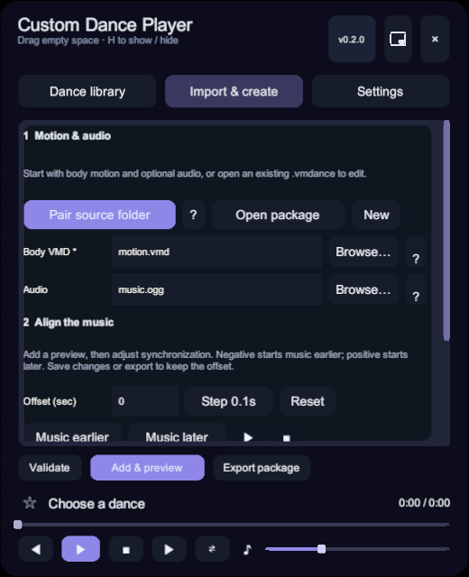

# Import and create



## Create a dance

1. Select a body motion `.vmd` and optional audio. Folder matching can fill in a set of MMD files.
2. Enter a title and file identifier. The title appears in the library; the identifier is used for the filename and library ID, such as `catch-the-wave`.
3. Validate the files, then add and preview. Use the bottom bar to pause, seek or stop.
4. Adjust audio timing, camera framing and IK, then export `.vmdance` or save the package you opened.

## Choosing VMD fields

Body motion requires bone animation. If one VMD contains body motion, expressions and lip sync, select it as body motion: embedded tracks are included.

| File | Field |
| --- | --- |
| VMD with bone motion | Body motion |
| Separate expressions or lip sync | Advanced expression/lip fields |
| Separate camera VMD | Advanced camera field |
| OGG, WAV or MP3 | Optional audio |
| A special motion reference PMX | Advanced reference PMX |
| Supplemental or overriding VMD | Additional layers; later layers override matching tracks |

Duplicate selections of the same body file in expression/lip fields are deduplicated. Embedded cameras are also supported. A camera-only or expression-only file cannot replace body motion.

The reference PMX describes the MMD motion skeleton; it is separate from the VRM character used in MateEngine. The included reference model is usually sufficient.

## Audio timing

Preview and adjust music earlier or later while listening. Choose steps of 0.1, 0.01 or 1 second, enter a value directly, or reset to zero. Negative values start music earlier; positive values delay it. Changes affect the current preview immediately, including while paused. Save or export when satisfied.

## Camera reference and foot IK

The creator captures the current character's original eye height independently of mouse-wheel display scaling. Preview the camera motion and adjust the reference multiplier. Both values are stored in the package.

```text
Current eye height / package reference eye height × package reference multiplier
```

A 1.4 m reference with a 0.5 multiplier adapts to 0.25 for a 0.7 m character. Opening an existing package preserves its author's values. To recalibrate, use the original reference character and capture its height again. Older dances without reference metadata use a 1.65 m baseline.

Foot IK can inherit the player default, follow the VMD, or be disabled. Start with the default; motions with baked FK may work better with IK disabled. This preference travels with the dance package.

Global Settings are personal playback preferences. Creation camera previews use package reference values so authors can adjust the dance's framing.

## Edit an existing package

Open a `.vmdance` to restore its files, title, audio offset, camera reference, IK and layers. Validate and preview after editing. Save edits updates the original with a backup; export writes a separate copy. Included assets are extracted for editing.

## Credits

The multiline field at the bottom of Advanced options records asset authors and sources, including links. For example:

```text
Camera: XXX
Motion: XXX
Model: XXX
```

Text and line breaks are saved in `.vmdance` and restored when opening a package. Edits and exported copies retain them.
