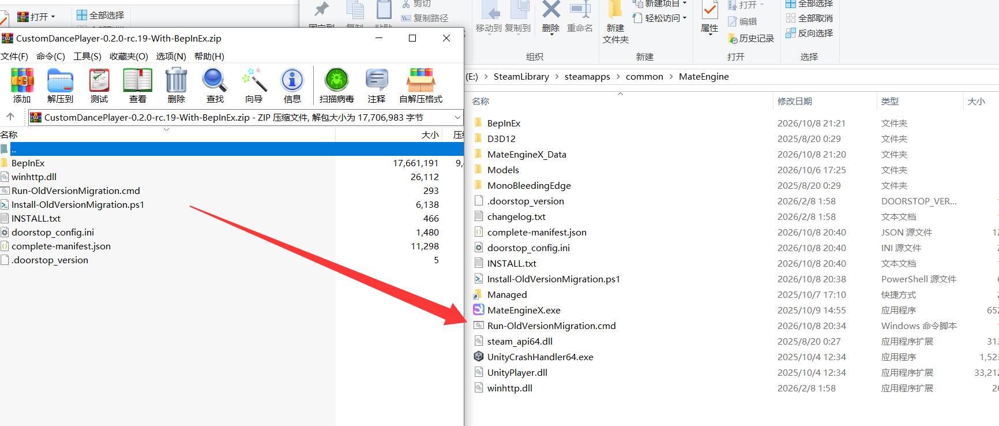

# 安装与 0.1.x 迁移 / Installation and migration

## 安装

1. 退出 MateEngine。在 Steam 库右键 **MateEngine → 管理 → 浏览本地文件**，找到包含 `MateEngineX.exe` 的目录。GitHub 版也以这个程序所在目录为准。
2. 下载带 `With-BepInEx` 的整合包，把全部内容解压到这个目录。`winhttp.dll` 应与 `MateEngineX.exe` 同级。
3. 启动游戏，按 **H** 打开播放器。

整合包已包含 BepInEx 和 MateEngine 所需的配置、运行库。已经装过这套环境时，后续更新可使用较小的插件包，把 `BepInEx` 文件夹合并到游戏目录。请复制完整插件文件夹。

安装后的游戏根目录可对照下图，重点确认 `BepInEx`、`winhttp.dll` 和 `doorstop_config.ini` 与 `MateEngineX.exe` 同级。



图中使用较早的安装包，版本号与附带说明文件可能有所不同；安装位置相同。

## 从 0.1.x 升级

解压整合包后，先双击 `Run-OldVersionMigration.cmd`，再启动游戏。脚本会备份旧 DLL、旧播放器 `.me` 和加载注册文件，然后移除旧入口。备份在游戏目录中的 `_CustomDancePlayer_Backup_*` 文件夹。

原有 `CustomDances` 舞蹈可以继续使用。脚本与控制台提示使用英文。

## 放置舞蹈

```text
MateEngineX_Data/StreamingAssets/CustomDances
```

支持子文件夹；面板中的“添加文件”也会放到这里。在设置页点击舞蹈目录旁的按钮，可直接打开文件夹。官方 `StreamingAssets/Mods` 中的舞蹈 `.me` 也会显示。

## 没有出现界面

确认 `winhttp.dll` 与游戏程序同级，插件完整位于 `BepInEx/plugins/CustomDancePlayer`。升级用户先运行迁移脚本，并检查是否存在重复的旧播放器文件。

日志在 `BepInEx/LogOutput.log`。反馈时请提供日志中的第一处报错、游戏版本和安装步骤。

## English

1. Exit MateEngine. In Steam, choose **Manage → Browse local files**. Use the folder containing `MateEngineX.exe` for either distribution.
2. Extract the entire `With-BepInEx` archive there. `winhttp.dll` must be beside the executable.
3. If upgrading from 0.1.x, run `Run-OldVersionMigration.cmd`. It backs up legacy player files and loading registrations to `_CustomDancePlayer_Backup_*` before removing the old loader.
4. Start the game and press **H**.

For later updates to an existing compatible setup, merge the smaller archive's `BepInEx` folder into the game directory. Copy the complete plugin folder.

Place dances in `MateEngineX_Data/StreamingAssets/CustomDances`, including subfolders. The Settings page can open this folder. Official dance `.me` files in `StreamingAssets/Mods` are also listed.

If the panel does not appear, check the installation location, migration and duplicate legacy files. Include the first error from `BepInEx/LogOutput.log` when reporting a problem.
